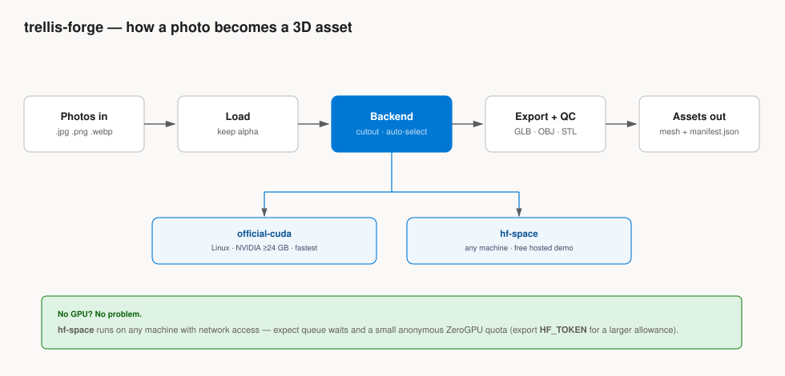
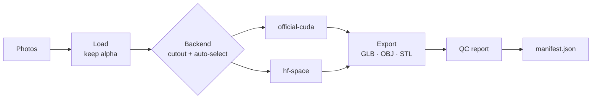
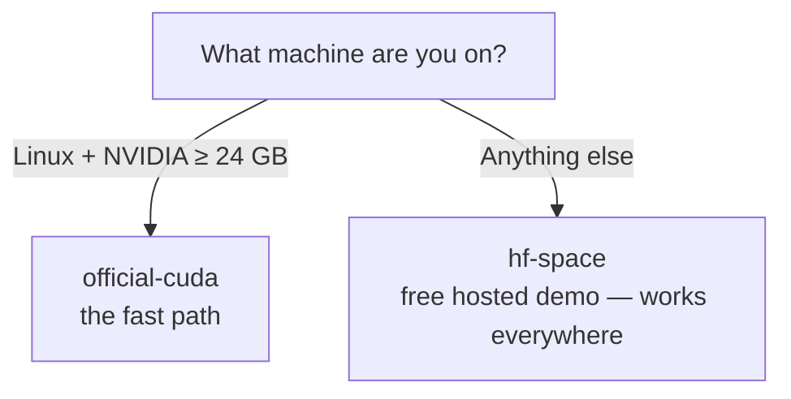

# trellis-forge

> **A folder of images in, production-usable 3D assets out** — batched, reproducible, and traced.

[](LICENSE)
[](https://www.python.org/downloads/)
[](https://github.com/rahulrajan/trellis-forge/actions/workflows/ci.yml)

```bash
trellis-forge generate ./photos -o ./assets
```

TRELLIS.2 is Microsoft Research's 4-billion-parameter model that turns a single
image into a fully textured PBR mesh (GLB). Upstream ships a research repo and
a demo Space, but no batch tooling. **trellis-forge is the batch front door:**
point it at a folder and every image becomes an asset — on your own NVIDIA GPU,
or on the free hosted demo when you don't have one.



---

## What is trellis-forge?

trellis-forge is a command-line wrapper around [Microsoft TRELLIS.2](https://microsoft.github.io/TRELLIS.2/)
that adds the things a research repo never will:

| Capability | What you get |
| --- | --- |
| **Batch** | Point it at a folder; every image becomes an asset, with per-image failure isolation and a live progress bar. |
| **Reproducibility** | The base seed is combined with each image's content hash, so every image gets its own seed and a rerun draws exactly the same samples. |
| **Provenance** | `manifest.json` records source-image hash, backend, seed, resolution, timings, and a geometry QC report. Interrupted batches resume where they stopped. |
| **Portability** | Two backends behind one flag: `official-cuda` (your GPU) and `hf-space` (the free hosted demo), auto-detected with `--backend auto`. |

It is deliberately *not* an interactive authoring tool.

> [!TIP]
> **TRELLIS.2 now runs natively in ComfyUI — no custom nodes, no compiled CUDA
> extensions.** Use that for interactive asset authoring. trellis-forge is for
> everything ComfyUI is bad at: headless batches, CI-style reproducibility, and
> machine-readable provenance.

---

## How it works

Every run flows through the same five stages, no matter which backend does the
heavy lifting:

1. **Photos in** — `.jpg` / `.png` / `.webp` are collected (optionally recursed).
2. **Load** — each photo is opened as RGB, or as RGBA when it already carries an
   alpha channel, which the model's own cutout step then honours.
3. **Backend** — `--backend auto` picks the first available engine (see below).
   The backend isolates the subject for you: TRELLIS.2 ships BiRefNet/RMBG-2.0,
   downscales to ≤1024 px and crops to a square around the foreground.
4. **Export + QC** — the backend's GLB is kept as the primary artifact; OBJ/STL are
   geometry-only convenience exports, and a watertight/face-count QC report is run.
5. **Assets out** — each asset lands in its own folder and the manifest is updated.



---

## Which backend should I use?

The short version: **an NVIDIA GPU if you have one, the hosted demo if you
don't.** `--backend auto` does exactly that.



| Backend | Runs on | Speed | Status |
| --- | --- | --- | --- |
| `official-cuda` | Linux + NVIDIA ≥ 24 GB (A100/H100/4090-class) | ~3 s sampling at 512³ on an H100 (upstream's figure); export dominates | supported path (via Dockerfile) |
| `hf-space` | **any machine with network** | queue-dependent | works today |

> [!NOTE]
> **`trellis-forge backends` tells you exactly which engines are usable on your
> machine.** It never guesses — it probes.

---

## Install

```bash
pip install trellis-forge    # everything, including the hosted backend
```

(`pipx install trellis-forge` works too, if you prefer isolated CLI installs.)

There's no background-removal extra to install — TRELLIS.2 does its own cutout.
The hosted backend needs nothing else; the CUDA backend additionally needs the
upstream TRELLIS.2 repo installed, which the
[Dockerfile](#official-cuda--the-fast-path) packages for you.

### Quick start

1. Install: `pip install trellis-forge`
2. Point it at a folder of photos:
   ```bash
   trellis-forge generate ./photos -o ./assets
   ```
3. Inspect the output: each image gets a folder with `mesh.glb`, and the run is
   recorded in `assets/manifest.json`.

---

## Backends, in depth

### official-cuda — the fast path

Requires Linux, CUDA 12.4, an NVIDIA GPU with ≥ 24 GB VRAM, and the upstream repo
installed into the same environment. The Dockerfile packages all of that:

```bash
docker build -t trellis-forge .
docker run --gpus all -v "$PWD/photos:/in" -v "$PWD/assets:/out" trellis-forge \
    generate /in -o /out --backend official-cuda --resolution 1024
```

No GPU of your own? Any cloud GPU works (RunPod/Vast/Lambda); an A100 hour
produces dozens of assets.

Details worth knowing:

- `--resolution` maps to upstream's `pipeline_type`: 512 runs direct sampling,
  1024 and 1536 run the cascade samplers.
- The pipeline runs in upstream's `low_vram` mode, which streams each sub-model
  onto the GPU only while it's in use.
- `--decimate` decimates backend-side during texture baking, so PBR textures
  survive; the OBJ/STL conversions are geometry-only. Unset, this path keeps
  upstream's own 1,000,000-face default — much heavier than the demo Space's
  300,000 — so pass it when file size matters.
- Export is wired like upstream's own demo (`app.py`), except that `attr_layout`
  and `voxel_size` are read off the mesh instead of derived from `--resolution`:
  a cascade run can decode at a resolution other than the one you asked for.
  This path has still not been validated on a live GPU, so treat your first run
  as a shakedown and report anything odd.

### hf-space — works on any machine

Uses `gradio_client` against the official `microsoft/TRELLIS.2` demo Space. No
local GPU, no 15 GB weights download — the realistic path for any laptop, at the
cost of queue waits and ZeroGPU quota: anonymous visitors get only a few
GPU-minutes per day, so export `HF_TOKEN` if you have a batch to get through.

Generation is a stateful three-step flow — `/preprocess_image`, `/image_to_3d`,
`/extract_glb` — with the Space holding the sampled latents against your session
in between, so the client never handles them. It's a shared research demo;
rate-limit yourself.

`trellis-forge backends` probes the Space for real and checks that all three
endpoints still exist, so if the API drifts you find out at backend selection
with a `view_api()` hint rather than partway through a batch.

---

## Usage

```bash
# What works on this machine?
trellis-forge backends

# A folder of product photos -> GLBs (the backend isolates each subject)
trellis-forge generate ./photos -o ./assets

# Game/web budget + printable STL alongside
trellis-forge generate ./photos -o ./assets --decimate 150000 --format glb --format stl

# Reproducible rerun of a subset (manifest skips finished images)
trellis-forge generate ./photos -o ./assets --seed 7 --limit 5

# No GPU at all — free hosted demo Space
trellis-forge generate ./photos -o ./assets --backend hf-space
```

Output layout:

```
assets/
├── manifest.json
├── molar-01-3fa2b9c1/
│   ├── mesh.glb          # textured PBR asset (primary artifact)
│   └── mesh.stl          # only if requested (geometry-only)
└── ...
```

Manifest paths are stored relative to `assets/`, so the whole tree can be moved,
synced, or shipped as-is.

---

## Notes on quality

- **Garbage in, garbage out.** The cutout is automatic, but the reconstruction is
  only as good as the photo: one object, neutral background, sharp focus, subject
  filling the frame. A PNG that already has an alpha channel is used as-is, so
  pre-cut subjects reach the model untouched.
- **Mesh QC is in the manifest** (`watertight`, face count, bounds). Upstream
  fills holes while decoding, but watertightness still isn't guaranteed — filter
  on `qc.watertight` if your downstream pipeline (3D printing, boolean CSG) needs
  manifolds.
- **Timing is unmeasured on consumer hardware.** Upstream publishes ~3 s of
  sampling at 512³ on an H100 and sub-100 ms for the voxel→mesh conversion, with
  remeshing and texture baking on top; we haven't timed it ourselves, so budget
  from your own first run. 1536³ is a quality/VRAM step up, 512³ the low-memory
  fallback.

---

## Licensing — read before shipping assets

> [!IMPORTANT]
> trellis-forge itself is MIT. **TRELLIS.2 is not simply "yours to ship."** The
> code/weights carry MIT labels on GitHub/Hugging Face, but Microsoft's official
> project page restricts the materials to *academic and research use* and
> explicitly prohibits commercial exploitation. Treat the stricter statement as
> governing.

- **Fine:** research, education, non-commercial projects, internal prototyping.
- **Get written confirmation first:** shipping generated assets in anything that
  takes money (paid app, ads, subscriptions).

You are also responsible for the rights to your **input images** — don't feed it
photos of people, patients, or copyrighted work you don't hold.

---

## Roadmap

- [ ] GPU validation run for `official-cuda` — the wiring now matches upstream
      source line for line, but it has never executed on real hardware
- [ ] Preview renders (turntable/contact sheet) per asset

There is no Apple Silicon item. TRELLIS.2 is Linux + CUDA only, and upstream has
had no feature commit since January 2026 — the only changes since are CI fixes.
If you're on a Mac, `hf-space` is the path.

---

## Development

```bash
pip install -e ".[dev]"     # or: uv pip install -e ".[dev]"
pytest                      # fast — needs no GPU, torch, or network
ruff check src tests
```

CI runs the same two commands on Python 3.11–3.14. The heavy engines (torch,
trellis2, gradio_client) are imported lazily inside backend methods, so the CLI,
preprocessing, and tests run on machines that have none of them.
