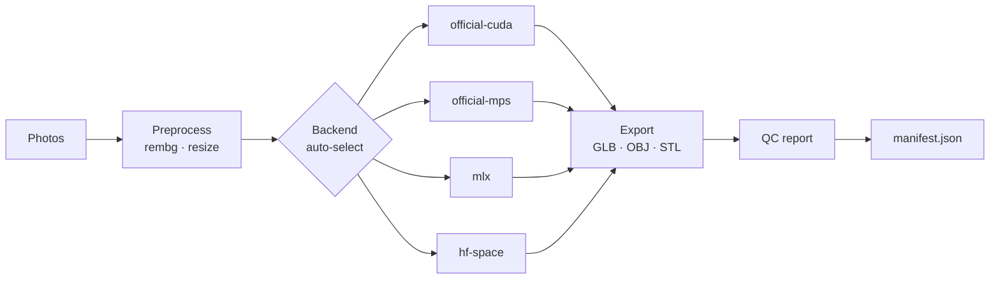
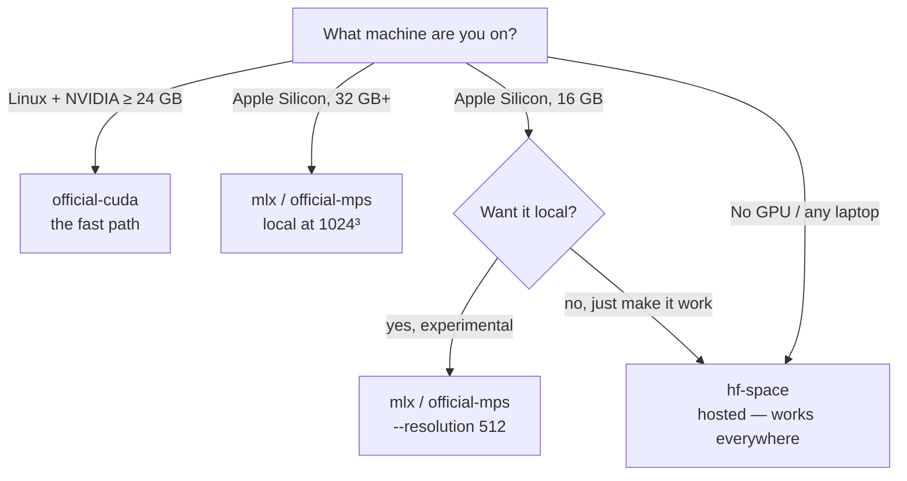

# trellis-forge

> **A folder of images in, production-usable 3D assets out** — batched, reproducible, and traced.

[](LICENSE)
[](https://www.python.org/downloads/)
[](#which-backend-should-i-use)

```bash
trellis-forge generate ./photos -o ./assets --backend auto --resolution 1024
```

TRELLIS.2 is Microsoft Research's 4-billion-parameter model that turns a single
image into a fully textured PBR mesh (GLB). Upstream ships a research repo and
Gradio demos but no batch tooling, and the community ports each speak their own
dialect. **trellis-forge is the one front door across all of them** — the same
command runs on an H100 box, a MacBook, or no GPU at all, because the backend is
a flag, not a fork.


---

## What is trellis-forge?

trellis-forge is a command-line wrapper around [Microsoft TRELLIS.2](https://microsoft.github.io/TRELLIS.2/)
that adds the things a research repo never will:

| Capability | What you get |
| --- | --- |
| **Batch** | Point it at a folder; every image becomes an asset, with per-image failure isolation. |
| **Reproducibility** | A base seed is combined with each image's hash, so a rerun is deterministic. |
| **Provenance** | `manifest.json` records source-image hash, backend, seed, resolution, timings, and a geometry QC report. Interrupted batches resume where they stopped. |
| **Portability** | CUDA, Apple Silicon (MPS or MLX), or a hosted demo — selected by a flag or auto-detected. |

It is deliberately *not* an interactive authoring tool.

> [!TIP]
> **ComfyUI wrappers are excellent for interactive asset authoring — use them.**
> trellis-forge is for everything ComfyUI is bad at: headless batches, CI-style
> reproducibility, and machine-readable provenance.

---

## How it works

Every run flows through the same five stages, no matter which backend does the
heavy lifting:

1. **Photos in** — `.jpg` / `.png` / `.webp` are collected (optionally recursed).
2. **Preprocess** — `--rembg` isolates the subject; oversized images are downscaled.
3. **Backend** — `--backend auto` picks the first available engine (see below).
4. **Export + QC** — the backend's GLB is kept as the primary artifact; OBJ/STL are
   geometry-only convenience exports, and a watertight/face-count QC report is run.
5. **Assets out** — each asset lands in its own folder and the manifest is updated.



---

## Which backend should I use?

The short version: **match the backend to your hardware, and let `--backend auto`
do it for you.** The longer version is the decision tree below.



| Backend | Runs on | Speed | On a 16 GB Mac? | Status |
| --- | --- | --- | --- | --- |
| `official-cuda` | Linux + NVIDIA ≥ 24 GB (A100/H100/4090-class) | ~1–2 min/asset | needs NVIDIA | supported path |
| `official-mps` | Apple Silicon (M-series) | ~20–30 min/asset @1024³ | 512³ best-effort | experimental — needs upstream PR #167 |
| `mlx` | Apple Silicon via [trellis2-mlx](https://github.com/gtrg55/trellis2-mlx) | minutes; 512³ on modest RAM | 512³ best-effort | experimental — local HTTP API |
| `hf-space` | **any machine with network** (free hosted demo) | queue-dependent | ✅ any resolution | works today |

`--backend auto` picks the first available in the order
`official-cuda → mlx → official-mps → hf-space`.

> [!NOTE]
> **Running `trellis-forge backends` tells you exactly which engines are usable on
> your machine**, including a memory-aware hint on low-memory Macs. It never
> guesses — it probes.

---

## Install

```bash
pip install trellis-forge            # core (needs a backend too)
pip install "trellis-forge[hf]"      # + free hosted backend (gradio-client)
pip install "trellis-forge[rembg]"   # + --rembg background removal
```

### Quick start

1. Install the core plus whichever backend you'll use (above).
2. Point it at a folder of photos:
   ```bash
   trellis-forge generate ./photos -o ./assets --rembg
   ```
3. Inspect the output: each image gets a folder with `mesh.glb` and the run is
   recorded in `assets/manifest.json`.

---

## Backends, in depth

### official-cuda — the fast path

Requires Linux, CUDA 12.4, an NVIDIA GPU with ≥ 24 GB VRAM, and the upstream repo
installed into the same environment. The Dockerfile packages all of that:

```bash
docker build -t trellis-forge .
docker run --gpus all -v "$PWD/photos:/in" -v "$PWD/assets:/out" trellis-forge \
    generate /in -o /out --backend official-cuda --resolution 1024
```

No GPU of your own? Any cloud GPU works (RunPod/Vast/Lambda); an A100 hour
produces dozens of assets.

### Apple Silicon — two experimental routes

Both are young, and both are honest about it.

1. **MPS** — apply [microsoft/TRELLIS.2 PR #167](https://github.com/microsoft/TRELLIS.2/pull/167)
   to a TRELLIS.2 checkout, then `--backend official-mps`. Verified upstream on an
   **M3 Pro (18 GB)** end-to-end (~24 min/asset at 1024³).
2. **MLX** — clone [gtrg55/trellis2-mlx](https://github.com/gtrg55/trellis2-mlx),
   start its API server once, and trellis-forge talks to it over HTTP:
   ```bash
   cd trellis2-mlx && python api_server.py      # loads ~15 GB of weights
   trellis-forge generate ./photos -o ./assets --backend mlx --resolution 512
   ```
   (Set `TRELLIS2_MLX_REPO` to the clone and `TRELLIS2_MLX_URL` if it isn't on
   `127.0.0.1:8000`.)

> [!IMPORTANT]
> **On a 16 GB unified-memory Mac** (e.g. an M3 MacBook), local generation is
> best-effort. Expect **512³ only**, close heavy apps during a run, and treat
> `hf-space` as the reliable zero-GPU answer. The MLX port is validated on
> 128 GB and no quantized Mac weights exist yet — shipping 4-bit MLX weights is
> the top roadmap item, and it's what will make 16 GB comfortable.

### hf-space — works on any machine

Uses `gradio_client` against the official `microsoft/TRELLIS.2` demo Space. No
local GPU, no weights download. The realistic path for any laptop, at the cost of
queue waits and whatever resolution the Space serves. Rate-limit yourself; it's a
shared research demo.

---

## Usage

```bash
# What works on this machine?
trellis-forge backends

# A folder of product photos -> GLBs, subject auto-isolated
trellis-forge generate ./photos -o ./assets --rembg

# Game/web budget + printable STL alongside
trellis-forge generate ./photos -o ./assets --decimate 150000 --format glb --format stl

# Reproducible rerun of a subset (manifest skips finished images)
trellis-forge generate ./photos -o ./assets --seed 7 --limit 5

# No GPU at all — free hosted demo Space
trellis-forge generate ./photos -o ./assets --backend hf-space
```

Output layout:

```
assets/
├── manifest.json
├── molar-01-3fa2b9c1/
│   ├── mesh.glb          # textured PBR asset (primary artifact)
│   ├── mesh.stl          # only if requested (geometry-only)
│   └── ...
```

---

## Notes on quality

- **Garbage in, garbage out.** Single-image 3D is only as good as the photo:
  isolated subject, neutral background, sharp focus, object filling the frame.
- **Mesh QC is in the manifest** (`watertight`, face count, bounds). Generated
  meshes can have small holes; filter on `qc.watertight` if your downstream
  pipeline (3D printing, boolean CSG) needs manifolds.
- **Expect ~1–5 min/asset on a 4090-class GPU** at 1024³ including export.
  1536³ is a quality/VRAM step up; 512³ is the low-memory fallback.

---

## Licensing — read before shipping assets

> [!IMPORTANT]
> trellis-forge itself is MIT. **TRELLIS.2 is not simply "yours to ship."** The
> code/weights carry MIT labels on GitHub/Hugging Face, but Microsoft's official
> project page restricts the materials to *academic and research use* and
> explicitly prohibits commercial exploitation. Treat the stricter statement as
> governing.

- **Fine:** research, education, non-commercial projects, internal prototyping.
- **Get written confirmation first:** shipping generated assets in anything that
  takes money (paid app, ads, subscriptions).

You are also responsible for the rights to your **input images** — don't feed it
photos of people, patients, or copyrighted work you don't hold.

---

## Roadmap

- [ ] Verify + complete the MLX adapter against `trellis2-mlx`'s API on a real Mac
- [ ] 4-bit quantized MLX weights for 16 GB Macs (the "safe on a laptop" milestone)
- [ ] Preview renders (turntable/contact sheet) per asset
- [ ] Watch upstream MPS support (PR #167) and drop the patch requirement when merged

---

## Development

```bash
pip install -e ".[dev]"
pytest
ruff check src tests
```

The heavy engines (torch, mlx, gradio_client) are imported lazily inside backend
methods, so the CLI, preprocessing, and tests run on machines that have none of
them.
