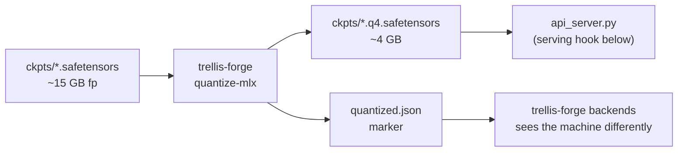

# 4-bit quantization for 16 GB Macs

TRELLIS.2 is a 4B-parameter model with ~15 GB of full-precision weights. macOS
gives the GPU roughly two-thirds of unified memory — about 10.7 GB on a 16 GB
Mac — so full-precision serving leaves no room for activations, and 1024³
generation walks into an OOM. This is the honest reason every other TRELLIS
tool treats 16 GB Macs as "best-effort 512³."

Quantization changes that math. `trellis-forge quantize-mlx` converts the
Linear layers of the port's models to 4-bit (group size 64), shrinking the
weight footprint to ~4 GB. After that, 1024³ on a 16 GB Mac is no longer a
squeak-through — it's the expected case.



## What gets quantized

- **Both flow transformers** (`sparse_structure_flow_model`, `flow_model`) —
  30 blocks of `nn.Linear` attention/MLP at `model_channels=1536`. This is
  where the parameter count lives, and where the savings come from.
- **The VAE decoders** (shape + texture) — their Linear layers, including the
  ones wrapped by the port's `MlxSparseLinear`.
- **Not quantized:** the custom sparse-conv kernels (they hold raw arrays, not
  `nn.Linear`, and are a small slice of the total) and the DINOv3 image
  encoder (loaded from Hugging Face, not from `ckpts/`).

Mechanics: each model is constructed exactly the way the port's pipeline
constructs it, fp weights are loaded with the port's remapping rules,
`mx.quantize(model, group_size=64, bits=4)` is applied, and the quantized
parameter tree is saved as `{name}.q4.safetensors` next to the original. The
saved keys are MLX-native (post-remap), so loading them back needs **no**
remapping. Each component is re-instantiated and the q4 file is loaded into it
as verification before moving on, and MLX's metal cache is cleared between
components so the run itself stays 16 GB-friendly.

## How to run it

```bash
# 1. The port's checkout + weights (once)
git clone https://github.com/gtrg55/trellis2-mlx
cd trellis2-mlx && python scripts/download_weights.py

# 2. Quantize — inside the port's own environment (it imports MLX + mlx_backend)
trellis-forge quantize-mlx --repo /path/to/trellis2-mlx
```

Output: `ckpts/{name}.q4.safetensors` files plus a `quantized.json` marker in
the weights directory. `trellis-forge backends` detects the marker and updates
its guidance. Reruns skip finished components; `--force` re-quantizes.

## The serving hook (upstream, not yet merged)

The port's `api_server.py` loads fp weights only. Until this lands upstream,
quantized weights are produced and verified but not served. The required
change in `mlx_backend/pipeline.py` is small — per loader, prefer the q4 file
when present:

```python
# e.g. in _load_mlx_flow_model, after constructing `model`:
q4_path = f"{path}.q4.safetensors"
if os.path.exists(q4_path):
    mx.quantize(model, group_size=64, bits=4)      # match saved layout
    model.load_weights(list(mx.load(q4_path).items()))  # keys already MLX-native
else:
    weights = remap_flow_model_weights(load_safetensors(f"{path}.safetensors"))
    model.load_weights(list(weights.items()))
```

…and a `quantized: bool` field in `/health` so clients can probe precision.
trellis-forge's MLX adapter already reads that field when present.

## Validation plan (real Mac)

Quality impact at 4-bit is **unmeasured** for TRELLIS.2 — no published numbers
exist. Before treating this path as supported:

1. Generate the same fixture image at 512³ with fp weights and with q4
   weights; diff the manifest's QC report (watertight, face count, bounds).
2. Eyeball texture fidelity on 2–3 varied subjects (thin geometry and text are
   the usual first casualties of quantization).
3. Record peak memory + wall time per resolution in the README's backend
   table.

If quality regresses visibly, `--group-size 32` or 6-bit are the fallbacks
the tooling already supports.

## Licensing

Quantized weights are derivatives of Microsoft's TRELLIS.2 weights — the
research/academic-only restriction in the README carries over to them, and to
anything generated with them.
